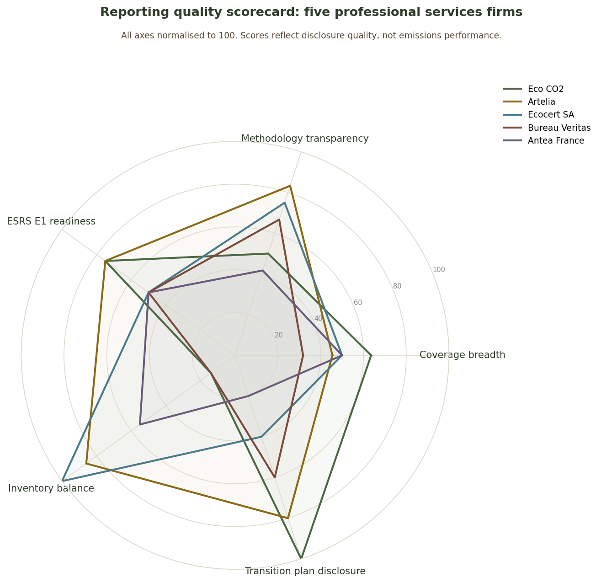
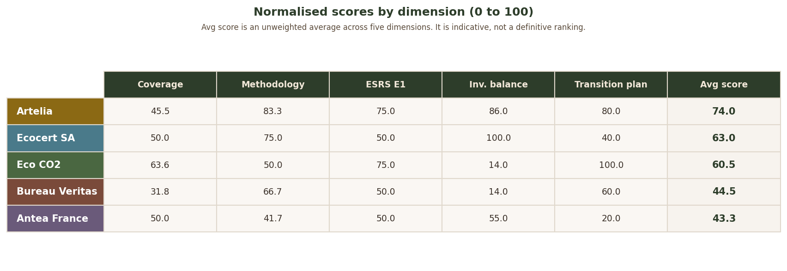
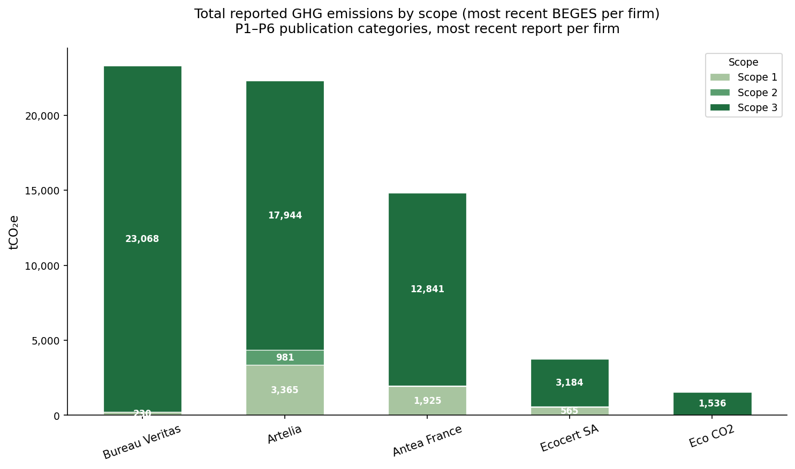
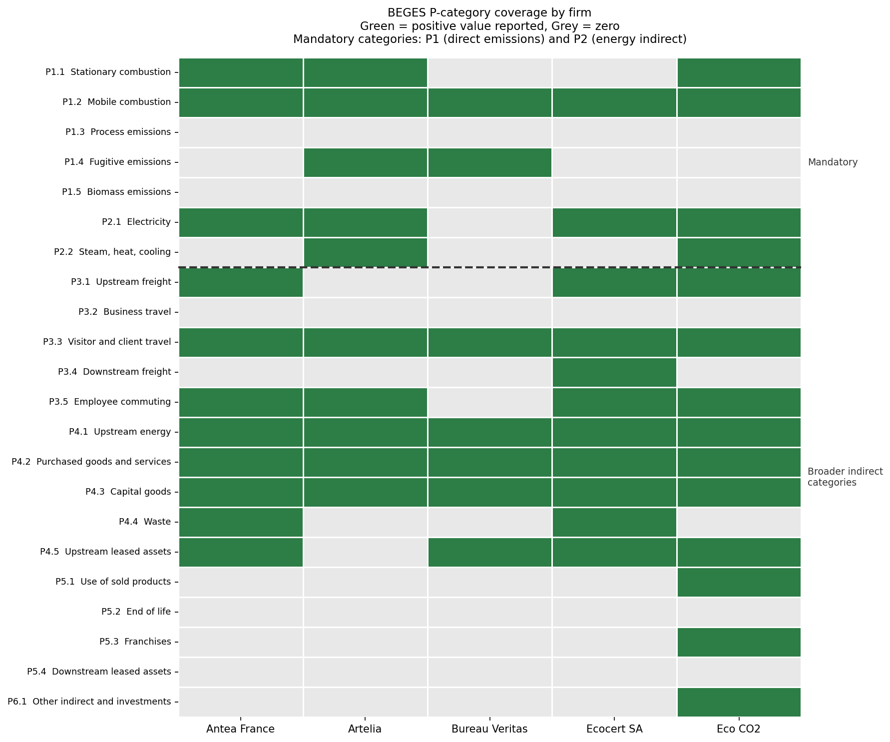
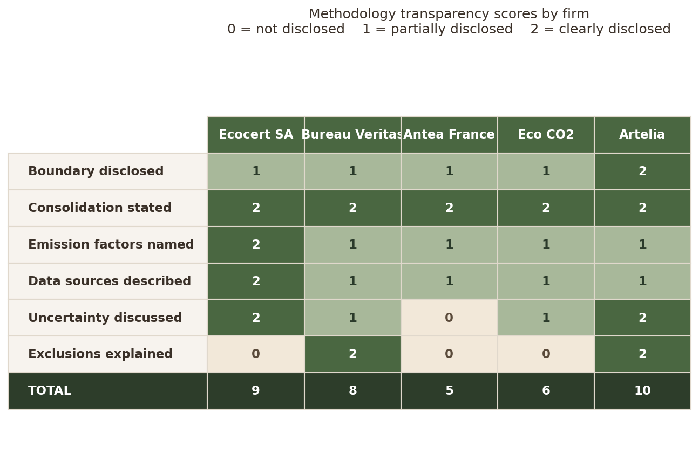
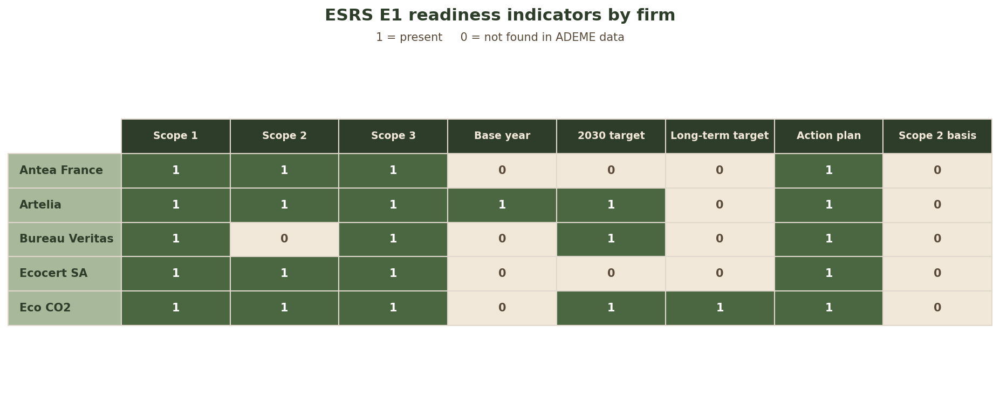
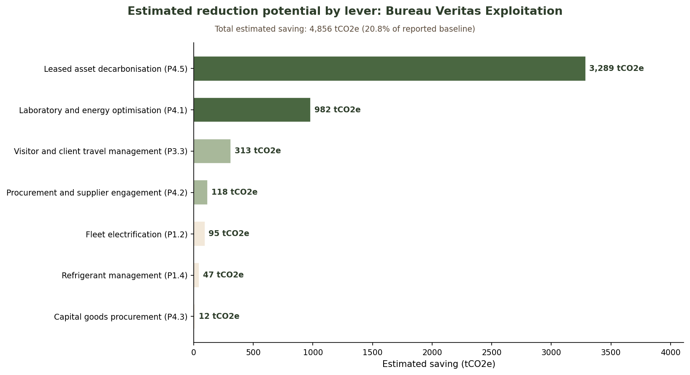

# bilan-critique

**A reporting quality assessment of greenhouse gas reporting across five French professional services firms working in environmental engineering, certification, inspection, and ecological transition, using publicly available BEGES data from the ADEME platform.**

**Author:** Emma McCallum
**GitHub:** github.com/ecmccallum
**Started:** May 2026
**Status:** Complete
**Last updated:** May 2026

This project asks whether firms whose work is connected to environmental performance, certification, inspection, engineering, and ecological transition produce transparent greenhouse gas reporting that is useful for decision making.

---

## Scorecard





The scorecard synthesises findings from six analytical notebooks into a five-axis
reporting quality profile per firm. The average score is an unweighted indicative
synthesis metric, not a formal rating.

| Artelia | 74.0 |
| Ecocert SA | 63.0 |
| Eco CO2 | 60.5 |
| Bureau Veritas | 44.5 |
| Antea France | 43.3 |

Scores reflect disclosure quality, not emissions performance.

---

## Key findings

**No firm scored consistently high across all five dimensions.** Reporting breadth,
methodology transparency, inventory balance, ESRS E1 readiness, and transition
plan disclosure do not necessarily move together. That is the central finding of
this project.

**Artelia had the strongest overall disclosure profile.** It performs consistently
across methodology transparency, inventory balance, and transition plan disclosure.
It is the only firm in this sample with an SBTi commitment identified in the
extracted fields. Its main weakness is coverage breadth at 45.5 percent.

**Eco CO2 had the strongest transition plan disclosure but the weakest inventory
balance.** It leads on coverage breadth and target setting, and ties
with Artelia on ESRS E1 readiness,
but 91.6 percent of its reported emissions sit in only two categories. Broad
coverage does not guarantee a balanced inventory.

**Ecocert SA provided the most detailed methodology disclosure** among the five
firms. It names specific database versions and gives structured uncertainty
estimates by scope. However, no 2030 or long-term reduction target appears in
its extracted fields.

**Bureau Veritas is the diagnostic case.** It has the highest reported emissions
at 23,298 tCO₂e, the narrowest category coverage at 7 of 22 BEGES categories,
and a significant tension between its methodology statement and its numerical
reporting pattern. The full text disclosure reveals strategic intent and a
quantified 2030 target, but the structured inventory data does not yet reflect
the depth of the narrative planning disclosure.

**Business travel is zero for every firm.** P3.2 is the single most analytically
significant zero in the dataset. For professional services and inspection firms
whose staff often work at client sites, this absence requires methodological
explanation.

**No firm addresses Scope 2 calculation basis.** ESRS E1 expects both
location-based and market-based Scope 2 figures. None of the five firms discloses
this in the structured ADEME export.

---

## Key analytical findings

### NB01: Emissions extraction



All five firms report Scope 3 equivalent emissions as more than 80 percent of
their total reported footprint. Bureau Veritas reports zero Scope 2 despite
being the highest total emitter at 23,298 tCO₂e. The full text disclosure
mentions renewable electricity certificates, suggesting a possible market-based
accounting explanation, but the structured export does not state the Scope 2
calculation basis explicitly.

| Firm | Reporting year | Total tCO₂e | Scope 3 share |
|------|---------------|-------------|---------------|
| Bureau Veritas | 2023 | 23,298 | 99.0% |
| Artelia | 2022 | 22,290 | 80.5% |
| Antea France | 2023 | 14,810 | 86.7% |
| Ecocert SA | 2024 | 3,761 | 84.6% |
| Eco CO2 | 2023 | 1,536 | 98.2% |

### NB02: Coverage matrix



Across all 110 firm and category combinations, 57 return zero and 53 return
a positive reported value. More than half of the firm and category combinations
contain no positive reported emissions value.

P3.2 business travel is zero for every firm. Given the activity profile of
professional services, engineering, inspection, and certification firms, this
category should be reviewed carefully in the methodology fields rather than
treated as automatically non-applicable.

| Firm | Categories reported | Share of 22 |
|------|--------------------|----|
| Eco CO2 | 14 | 63.6% |
| Antea France | 11 | 50.0% |
| Ecocert SA | 11 | 50.0% |
| Artelia | 10 | 45.5% |
| Bureau Veritas | 7 | 31.8% |

A high Scope 3 equivalent share does not imply broad category coverage.
Bureau Veritas reports 99.0 percent Scope 3 equivalent emissions but covers
only 7 of 22 categories.

### NB03: Methodology audit



Firms are not equally transparent even when they use the same consolidation
method. Ecocert names Base Empreinte v23.2 and the Orki platform. Artelia is
the only firm to explain its zero categories with explicit justifications.
Bureau Veritas states all posts were reviewed with no materiality threshold,
yet reports positive values in only 7 of 22 categories.

| Firm | Transparency score / 12 |
|------|------------------------|
| Artelia | 10 |
| Ecocert SA | 9 |
| Bureau Veritas | 8 |
| Eco CO2 | 6 |
| Antea France | 5 |

The boundary field for most firms contains organisational marketing text rather
than an accounting boundary definition. That is a systematic transparency gap
across the dataset.

### NB04: ESRS E1 readiness



No firm addresses Scope 2 calculation basis in the structured export. Only
Eco CO2 discloses a long-term climate target. Only three firms disclose a
2030 reduction target. All five have an action plan, but only Artelia has a
calculated reference year in the extracted fields. The
other four firms explicitly state that no reference year
has been calculated, which means progress against any
stated target cannot be formally tracked from the
structured data alone.

The most consequential systemic gap is the absence of long-term targets and
Scope 2 methodology disclosure. These indicate whether a firm's inventory is
connected to a structured climate strategy rather than functioning only as a
regulatory emissions declaration.

### NB05: Transition plan review



Bureau Veritas was selected because it combines the highest reported emissions,
the narrowest category coverage, and the clearest tension between narrative
planning and structured numerical reporting.

The full text disclosure reveals a firm more strategically engaged than the
structured export suggested. It has a quantified 2030 target of minus 40
percent on Scopes 1 and 2 and minus 25 percent on Scope 3, a structured
action plan, and a governance structure including a dedicated Mobility Committee.

The illustrative reduction scenario achieves 4,856 tCO₂e savings, equal to
20.8 percent of the reported baseline, using only categories with positive
structured baselines. P4.5 upstream leased assets and P4.1 upstream energy
together account for 88 percent of the modelled reduction potential. Fleet
electrification, refrigerant management, and capital goods procurement are
operationally relevant but quantitatively secondary.

Reaching the disclosed 25 percent Scope 3 target would require stronger action
on P4.5 and P4.1, and measuring currently zero categories to establish a
complete baseline. The 23,298 tCO₂e reported figure should be treated as a
floor, not a ceiling.

A domain-specific laboratory emissions analysis applies analytical chemistry
expertise to identify plausible energy and consumables reduction levers,
including HVAC and ventilation optimisation, cold storage and instrumentation
loads, and green analytical chemistry for solvent and reagent reduction linked
to P4.2 and P4.4.

---

## What this project measures

Five axes, each scored 0 to 100:

| Axis | Source | What it captures |
|------|--------|-----------------|
| Coverage breadth | NB02 | Percentage of 22 BEGES categories with a positive reported value |
| Methodology transparency | NB03 | Six-criterion rubric inspired by ISO 14064-1 and GHG Protocol |
| ESRS E1 readiness | NB04 | Eight-criterion readiness checklist |
| Inventory balance | NB02 derived concentration analysis | Percentage of emissions outside the top two categories |
| Transition plan disclosure | ADEME target and action plan fields | Five-criterion rubric on target and action plan quality |

All scores are based on publicly available ADEME structured data and free-text fields. They measure what firms chose to disclose, not what they are actually doing.

---

## Why this project matters

Published BEGES reports are often used as emissions data sources, but they can also be analysed as reporting documents. A reported emissions total is only useful if the boundary, category coverage, emission factors, data sources, uncertainty, exclusions, and targets are transparent enough to interpret.

This project applies BEGES category analysis, ISO 14064-1 inspired transparency criteria, GHG Protocol Corporate and Scope 3 logic, and ESRS E1 readiness indicators to compare reporting quality across firms operating in a similar professional services space.

The project demonstrates carbon accounting literacy, Python data analysis, regulatory interpretation, and consulting style synthesis across a complete analytical workflow from raw data to scored deliverable.

One section applies analytical chemistry domain knowledge to the Bureau Veritas transition plan review. The laboratory emissions analysis identifies major energy and consumables levers in analytical testing environments, including ventilation, fume hoods, instrumentation, cold storage, solvent use, reagents, and hazardous waste. This connects the carbon reporting critique to the operational reality of testing and inspection laboratories.

---

## Notebook workflow

| Notebook | Purpose | Status |
|----------|---------|--------|
| 00_firm_selection | SQL filtering of 11,138 organisations to five candidates | Complete |
| 01_emissions_extraction | BEGES P-category extraction, scope mapping, stacked bar chart | Complete |
| 02_coverage_matrix | Coverage classification, seaborn heatmap, coverage summary | Complete |
| 03_methodology_audit | Free-text extraction, six-criterion transparency scoring | Complete |
| 04_esrs_e1_checklist | Eight-criterion ESRS E1 readiness assessment | Complete |
| 05_transition_plan_review | Bureau Veritas transition plan, lever analysis, laboratory section | Complete |
| SC_scorecard | Five-axis radar chart and summary table synthesis | Complete |

---

## Data source

The primary data source is the ADEME BEGES open-data export, downloaded from
bilans-ges.ademe.fr in May 2026. The raw dataset contains published GHG
inventories from over 11,000 French organisations.

`data/raw/export-opendata-inventories-03-05-2026.csv`

---

## Methods and scoring logic

**Coverage breadth** uses the percentage of 22 BEGES categories with a positive
tCO₂e value, directly from `coverage_summary.csv`.

**Methodology transparency** applies a six criterion manual review rubric scored 0 to 2 per criterion, inspired by ISO 14064 1 and GHG Protocol transparency principles. Criteria: organisational boundary disclosed, consolidation method stated, emission factors named, data sources described, uncertainty discussed, exclusions explained. Maximum 12 points, normalised to 100.

**ESRS E1 readiness** applies an eight criterion binary checklist. Criteria: Scope 1 disclosed, Scope 2 disclosed, Scope 3 disclosed, base year disclosed, near term target disclosed, long term target disclosed, transition plan present, Scope 2 basis addressed. Maximum 8 points, normalised to 100. This is framed as a readiness indicator, not a legal compliance assessment. A full ESRS E1 assessment would require the company’s sustainability statement, double materiality assessment, climate risk disclosures, policies, transition plan details, and assurance context.

**Inventory balance** calculates the percentage of total reported emissions sitting outside the top two categories, then max normalises to 100. Higher scores indicate that the reported inventory is less dependent on one or two dominant categories.

**Transition plan disclosure** applies a five criterion binary rubric based on extracted ADEME target and action plan fields. Criteria: 2030 target disclosed, long term target disclosed, action plan present, actions linked to emissions categories, actions quantified with measurable indicators. Maximum 5 points, normalised to 100. This scores disclosure quality, not plan effectiveness.

---

## Limitations and interpretation caveats

In the processed ADEME export used here, blank or non disclosed category values are not distinguishable from zeros in the structured emissions columns. It is therefore not possible from the structured data alone to distinguish a genuine zero from a non disclosed or unreported category. All zero values are treated as prompts for methodology review rather than as automatic evidence of poor reporting.

Scores are based on ADEME structured data and free text fields only. Firms may have stronger internal documentation, more complete data, or more detailed methodology not captured in the public export.

The transition plan lever analysis for Bureau Veritas uses estimated savings based on the reported emissions profile and the firm’s public ADEME action plan text. These are illustrative scenarios, not verified forecasts.

The scorecard average is an unweighted synthesis metric. The individual dimension scores are more analytically meaningful than the ranking itself.

---

## Technical stack

| Tool | Purpose |
|------|---------|
| Python 3.13 | Primary language |
| DuckDB | SQL queries on CSV files |
| pandas | Data loading, transformation, inspection |
| matplotlib | Visualisation including radar chart and lever analysis |
| seaborn | Coverage heatmap |
| Jupyter | Analysis and documentation |

---

## Repository structure

```
bilan-critique/
├── data/
│   ├── raw/
│   │   └── export-opendata-inventories-03-05-2026.csv
│   └── processed/
│       ├── selected_firms.csv
│       ├── five_firms_full.csv
│       ├── emissions_long.csv
│       ├── firm_summary.csv
│       ├── coverage_matrix.csv
│       ├── coverage_summary.csv
│       ├── transparency_scores.csv
│       └── esrs_scores.csv
├── notebooks/
│   ├── 00_firm_selection.ipynb
│   ├── 01_emissions_extraction.ipynb
│   ├── 02_coverage_matrix.ipynb
│   ├── 03_methodology_audit.ipynb
│   ├── 04_esrs_e1_checklist.ipynb
│   ├── 05_transition_plan_review.ipynb
│   └── SC_scorecard.ipynb
├── figures/
│   ├── 01_emissions_by_scope.png
│   ├── coverage_heatmap.png
│   ├── transparency_scores.png
│   ├── esrs_checklist.png
│   ├── bv_levers.png
│   ├── scorecard_radar.png
│   └── scorecard_table.png
├── references/
│   ├── ghg-protocol-revised.pdf
│   ├── Corporate-Value-Chain-Accounting-Reporing-Standard-EReader_041613_0.pdf
│   └── Methode_pour_la_realisation_des_BEGES_Art_L22925_Version_4.pdf
├── README.md
└── requirements.txt
```

---

## How to reproduce

```bash
git clone https://github.com/ecmccallum/bilan-critique
cd bilan-critique
pip install -r requirements.txt
jupyter notebook
```

Run the notebooks in order from 00_firm_selection to 05_transition_plan_review, then run SC_scorecard last. The scorecard depends on processed CSV outputs generated by the earlier notebooks.

The raw ADEME export is not committed to the repository because of file size. Download it from the ADEME BEGES platform and place it here:
 `data/raw/export-opendata-inventories-03-05-2026.csv`.

---

## Skills demonstrated

| Skill area | Detail |
|------------|--------|
| Carbon accounting | GHG inventory assessment across Scope 1, Scope 2, and Scope 3 equivalent reporting |
| BEGES framework | P-category structure, ADEME export logic, and scope equivalent mapping |
| ISO 14064-1 | Transparency criteria applied to real published GHG reports |
| GHG Protocol | Corporate and Scope 3 Standards interpreted and applied to service sector reporting |
| ESRS E1 and CSRD | Readiness assessment framed as analytical indicators, not legal compliance judgment |
| SQL | Data extraction and filtering with DuckDB across more than 11,000 published inventory records |
| Python and pandas | Wide to long transformation, pivot tables, groupby aggregation, classification logic, score normalisation |
| Data visualisation | Seaborn heatmaps, matplotlib radar charts, horizontal bar charts, and styled table figures |
| Scoring framework design | Manual review rubrics, binary checklists, normalisation, and synthesis scoring |
| Consulting style analysis | From raw public data to diagnostic findings, scorecard synthesis, and recommendations |
| Laboratory emissions | HVAC and ventilation optimisation, cold storage energy loads, instrumentation scheduling, solvent and reagent reduction, green analytical chemistry |


